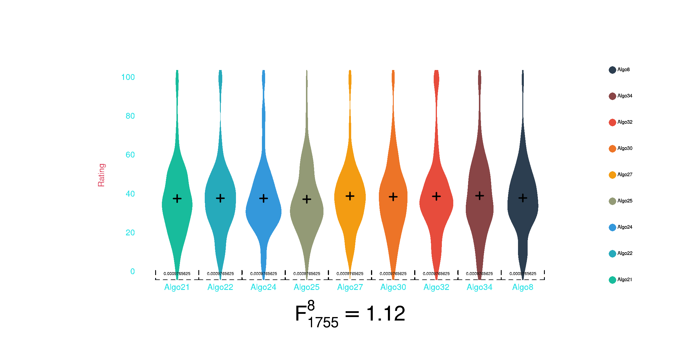

```{r}
library(broom)
library(humdrumR)
```

# Data Analysis

## What is the goal of data analysis?

+ To support *valid* research claims.
+ To be **rigorously skeptical** about our data and our models of the data.
  + Recognize assumptions made about data/models.
  + Consider alternative explanations of observed relationships.
  + Try to disprove (falsify) your models.
+ This is what reviewers expect.

# Null Hypothesis Significance Tests

## Motivation

+ The standard approach to experimental statistics across many fields of research.
+ A crucial opportunity to falsify your hypothesis.
+ A validly-conducted "significant" test is (essentially) required to make a positive claim about your hypothesis.


## Core Idea

+ The *Null Hypothesis* ($H_0$), is that there are no **true** relationship between independent and dependent variable(s).
+ Any *apparent relationships* may arise purely by random chance. 
+ If we claim a relationship is real when it is not we make a Type 1 error.   
  + NHST is a mechanism for limiting Type 1 errors.


## Core Method {.smaller}

::: {.panel-tabset}

### A priori


1. Pick an "$\alpha$ level" (acceptable Type 1 error rate).
  + Just kidding; $\alpha := 0.05$
2. Describe a statistical model of the relationship(s) between experimental variables.
  + Usually a variant of the General Linear Model.
  + $\beta_0 + \beta_1X + \epsilon = Y$
    + Includes assumptions about distribution of residual error! ($\epsilon$)
3. Characterize the Null Hypothesis in the context of that model.
  + Usually, something like $H_0: \beta_1 = 0$.

### A posteriori

4. Gather data.
5. Compute probability of observed data, or “more extreme” data, given $H_0$.
   + This is a $p$ value.
6. Evaluate:
   + If $p \leq \alpha$, then result is considered significant.
     + Your research claim *may* be valid.
   + If $p > \alpha$, then result is not significant.
     + Your research claim is falsified.
       + (To argue otherwise will be an uphill battle.)


:::

## Interpretation

Following this method assures that at most 5% of positive (significant) research claims are Type 1 errors.

+ It does not...
  + *Prove* anything, either way.
  + Demonstrate that a relationship (effect) is strong, or important.
  + Tell us about Type 2 errors.


# Statistical Models

What does this look like in practice?

+ Find a statistical model that can represent your independent and dependent variables.
  + `DV ~ IV`
+ In fact, when you design your experiment in the first place, consider what statistical model to use.


## {.smaller}

There are many standard models/tests:

:::: {.columns}

::: {.column width='60%'}


+ For many, $p$-values can be computed trivially.

:::

::: {.column width='40%'}

+ Linear regression
+ $t$-test
+ ANOVA
+ MANOVA

::: 

::::

:::: {.columns}

::: {.column width='60%'}

+ Others require algorithmic “fitting” process (equivalent to "training" in ML).

:::

::: {.column width='40%'}

+ Logistic regression 
+ Multinomial regression
+ Multi-level models

::: 
::::

+ All are variants of General Linear Model.

## {.smaller}

The appropriate statistical model/test depends on the type of DV and IVs you have. 
		
DV ~ $IV_1 + (+ IV₂ + … + IVₙ)$


::: {.panel-tabset}

### 

### Numeric DV


|  $IV_{k}$                             | Model                      |                           | Test Statistic |
|:--------------------------------------|:---------------------------|:--------------------------|:---------------|
|  $\mathbb{R}^k$                       | Linear regression          | $k=1 :$ "Simple"          | $t$            |
|                                       |                            | $k>1 :$ "Multiple"        | $t^k$          |
|  $\mathbb{Cat}\{2\}$                  | $t$-test                   |                           | $t$            |
|  $\mathbb{Cat}\{\geq 2\}^k$           | ANOVA                      | $k=1 :$ "One-way"         | $F$            |   
|                                       |                            | $k>1 :$ "{k}-way"         | $F^k$          |
|  $\mathbb{R}^* \times \mathbb{Cat}^*$ | ANCOVA                     |                           | $F^k$          |

+ These models all assume a normally-distributed DV.
+ Tests are based on $t$ or $F$ sampling distributions.


### Categorical DV

|  $DV_{k}$                             | Model                      |                                         | Test Statistic |
|:--------------------------------------|:---------------------------|:----------------------------------------|:---------------|
|  $\mathbb{Cat}\{2\}$                  | Logistic regression        | $\mathbb{Cat}(IV) :$ "Logistic ANOVA"   | $\chi^2$       |
|  $\mathbb{Cat}\{>2\}$                 | Multinomial regression     |                                         | $\chi^2$       |

+ In these models, a latent linear variable is mapped to discrete categories.
+ Evaluated using log-likelihood ratio test.

### Ordinal DV

|  $DV_{k}$                             | Model                      | Test Statistic |
|:--------------------------------------|:---------------------------|:---------------|
|  $\mathbb{Ord}\{>2\}$                 | Ordinal logit regression   | $\chi^2$       |
|  $\mathbb{Cat}\{>2\}$                 | Oridnal probit regression  | $\chi^2$       |

+ In these models, a latent linear variable is mapped to ordinal categories.
+ Evaluated using log-likelihood ratio test.

:::


# Examples


<!-- ## Fake Data -->


<!-- ```{r, echo = TRUE} -->

<!-- N <- 100 -->
<!-- X1_R <- rnorm(N) -->
<!-- X2_R <- rnorm(N) -->
<!-- X3_Cat2 <- gl(2, N / 2, labels = c('On', 'Off')) |> sample() -->
<!-- X4_Cat5 <- gl(5, N / 5, labels = LETTERS[1:5]) -->

<!-- sigma <- 10 -->

<!-- Y <- 5.2 + 1 * X1_R +  -->
<!--   -11.2 * X1_R +  -->
<!--   as.integer(X3_Cat2) * 7.2 +  -->
<!--   (contrasts(X4_Cat5) %*% c(c(1, 3, -10, 5)))[X4_Cat5] + -->
<!--   rnorm(N, 0, sigma) -->


<!-- ``` -->

<!-- ## {.smaller} -->


<!-- ::: {.panel-tabset} -->

<!-- ### Linear -->

<!-- ```{r} -->
<!-- fit <- lm(Y ~ X1_R) -->

<!-- plot(Y ~ X1_R) -->
<!-- abline(fit) -->

<!-- fit |> tidy() -->
<!-- ``` -->

<!-- ### t-test -->

<!-- ```{r} -->
<!-- fit <- lm(Y ~ X3_Cat2) -->

<!-- plot(Y ~ X3_Cat2) -->
<!-- abline(fit) -->

<!-- fit |> tidy() -->

<!-- ``` -->

<!-- ### One-way ANOVA -->


<!-- ```{r} -->
<!-- fit <- lm(Y ~ X4_Cat5) -->

<!-- plot(Y ~ X4_Cat5) -->

<!-- fit |> anova() |> tidy() -->

<!-- ``` -->

<!-- ### 2 X 5 ANOVA -->

<!-- ```{r} -->
<!-- fit <- lm(Y ~ X3_Cat2 * X4_Cat5) -->

<!-- tapply(Y, list(X3_Cat2, X4_Cat5), mean) |> barplot(beside = TRUE) -->

<!-- fit |> anova() |> tidy() -->

<!-- ``` -->


<!-- ::: -->


## Quality Evaluation Data

```{r, echo = c(2, 6)}
par(cex.axis = .6, pch = 16, cex = .5)
SiSEC <- read.csv('../SiSEC08_source_separation/SiSEC08_anonymized.csv') |> subset(grepl('Algo', Condition))
SiSEC <- as.data.table(SiSEC)
SiSEC[, Order := rank(Ratingscore + rnorm(length(Ratingscore), 0, 40)), by = Listener]
SiSEC <- SiSEC[order(SiSEC$Listener, SiSEC$Order), ]

```


**SiSEC** dataset.

+ Fourteen participants.
+ Nine test conditions (algorithms).
+ Fourteen base audio recordings (8 speech, 6 music).
+ $N = 14 * 9 * 14 = 1764$ total ratings.

----

Ratings range from 0 to 100.

```{r}
draw(SiSEC$Ratingscore)

```

----

```{r}
# plot(Ratingscore ~ factor(Condition), data = SiSEC)
SiSEC |> with(draw(Condition, Ratingscore))
```

How do approach this using NHST?

+ Start from a place of skepticism:
+ What if this is all noise?
  + All nine algorithms perform actually perform equally well.
  + The "omnibus" $H_0$.

---

```{r}
# plot(Ratingscore ~ factor(Condition), data = SiSEC)
SiSEC |> with(draw(Condition, Ratingscore))
```

  
+ Numeric DV:
  + Model as normal error.
+ Multinomial IV:
  + One-way Analysis of Variance (ANOVA).

---

#### ANOVA

If $H_0$ true, ratio of between-group and with-group variance should follow the $F(\frac{df_1}{df_2})$ distribution.
    
+ From 
   
```{r, message = FALSE}
library(gifski) 

save_gif(gif_file = 'images/ANOVAs.gif', delay = .5, progress = FALSE, {
  for (i in 1:100) {
    
    ratings <- SiSEC$Ratingscore |> sample()
    fit <- lm(ratings ~ SiSEC$Condition)
    draw(SiSEC$Condition, ratings)
    mtext(bquote(F[1755]^8 == .(round(summary(fit)$fstatistic[1], 2))), 3, cex = 2)
  }
  
})




```

---    
    
    

```{r}
fit <- lm(Ratingscore ~ Condition, data = SiSEC)

anov <- function(fit) {
  Fs <- summary(fit)$fstatistic
  
  
  curve(df(x, 8, 1755), 0, Fs, n = 1000, col = 'blue', xlim = c(0, 100),
        xlab = quote(F[1755]^8), ylab = quote(paste(Density, '|', H[0])),
        axes = FALSE)
  curve(df(x, 8, 1755), Fs, 100, n = 1000, col = 'red', xlim = c(0, 100), add =TRUE)
  axis(1, seq(0, 100, 10), tick = FALSE)
  axis(2, seq(0, 1, .2), tick = FALSE, las = 1)

  points(Fs[1], df(Fs[1], 8, 1755), col = 'red')

  anova(fit) |> tidy()
}

anov(fit)


```

+ As we suspected, the omnibus Null Hypothesis does not seem very plausible.

----


However, in typical MIR projects, asking whether all the algorithms perform the same wouldn't really be the thing that interests us.

We'd be more likely to want to know whether a particular algorithm performs better than the other algorithms, or better than a the previous "best" algorithm.

---

If we wanted to compare the latest algorithm (34) to the previous iteration (32), we can reduce this to a $t$-test.

+ $H_0:$ the performance of Algo32 and Algo34 is the same.

```{r}
fit <- lm(Ratingscore ~ Condition, data = SiSEC |> subset(Condition %in% c('Algo32', 'Algo34')))


tv <- function(fit) {
  tval <- summary(fit)$coef[2, 't value']
  
  curve(dt(x, 390), tval, -tval, n = 1000, col = 'blue', xlim = c(-4, 4), ylim = c(0, .5),
        xlab = quote(t[390]), ylab = quote(paste(Density, '|', H[0])),
        axes = FALSE)
  curve(dt(x, 390), -4, tval, n = 1000, col = 'red', add =TRUE)
  curve(dt(x, 390), -tval, 4, n = 1000, col = 'red', add =TRUE)
  
  xs <- seq(-4, tval, length.out = 30) 
  polygon(c(xs, rev(xs)), c(dt(xs, 390), rep(0, length(xs))), col = rgb(1,0,0,.4), border = FALSE)
  axis(1, -4:4, tick = FALSE)
  axis(2, seq(0, 1, .1), tick = FALSE, las = 1)

  points(tval, df(tval, 8, 1755), col = 'red')

  anova(fit) |> tidy()
}
tv(fit)
lm(fit) |> summary() |> tidy()

```

+ Two things to notice:
  + Algorithm 34 actually has slightly *lower* performance on average (`-.2143`).
  + However, the test is not significant, so the Null Hypothesis cannot be rejected.
    + We would not conclude that Algorithm 34 is worse than Algorithm 32.
    
    
<!-- --- -->

<!-- Perhaps we'd like to know whether the best performing algorithm (22) is really better than the second best (30)? -->

<!-- ```{r} -->

<!-- plot(Ratingscore ~ factor(Condition), data = SiSEC) -->

<!-- fit <- lm(Ratingscore ~ Condition, data = SiSEC |> subset(Condition %in% c('Algo22', 'Algo30'))) -->

<!-- lm(fit) |> summary() -->

<!-- ``` -->

## Emotion Data


```{r}
emote <- fread('../Eerola_emotion/mean_ratings_set1.csv')

emote
```

+ We might, for example, test the hypothesis that perceived energy is related to rension.

---


```{r}
with(emote, draw(energy, tension, xlab = 'Energy', ylab = 'Tension'))

```

+ Numeric DV:
  + Model as normal error.
+ Numeric IV:
  + Simple linear regression.
  + $H_0: \beta = 0$
  
----


```{r, echo = -1}
with(emote, draw(energy, tension, xlab = 'Energy', ylab = 'Tension', lm = TRUE))

fit <- lm(tension ~ energy, data = emote)

summary(fit) |> tidy(conf.int = TRUE)

```

----

#### Multiple Regression

The simple regression looks at two variables in isolation.
If we add more independent variables, the independent effect of *each* can be evaluated.

```{r}
fit2 <- lm(tension ~ energy + anger + fear + valence, data = emote)

```

----


```{r}
fit2 <- lm(tension ~ energy * TARGET, data = emote)

```

#### Logistic Regression

```{r}
negative <- c('ANGER', 'FEAR', 'LOW VALENCE', "SAD", 'HIGH TENSION')

emote$Negative <- emote$TARGET == negative

glm(Negative ~ valence + energy + tension + anger + fear + happy + sad + tender, data = emote) |> anova()

```


# NHST pitfalls


In general, NHST is sensitive to the exact procedure you use.


:::: {.columns}

::: {.column width='50%'}

+ Any procedural decisions made *post-hoc* and affect the validity of results.
+ I.e., if you use the data to to make decisions about stats/tests.

:::

::: {.column width='50%'}

+ Stopping condition
  + When you stop collecting data.
+ Which comparisons you make.

:::

::::


----

Perhaps we'd like to know whether the best performing algorithm (22) is really better than the rest of the algorithms?

```{r}

SiSEC |> with(draw(Condition, Ratingscore))
```

---

```{r}

SiSEC$BestAlgo <- SiSEC$Condition == 'Algo22'

fit <- lm(Ratingscore ~ BestAlgo, data = SiSEC)

lm(fit) |> summary()

```

+ This is significant.
+ However, there is a problem...
  + We did not identify this "best algorithm" *a priori*.
  + And the NHST is sensitive to this.
  
---

Imagine that the Null Hypothesis *were* true: all algorithms performed equally well.

+ Every time we sample responses, one algorithm will perform best in the sample.
  + By picking this one out, we are (by definition) biasing the result.
  
---

We can simulate this. 

```{r}
Nsim <- 1000

pvalues <- sapply(1:Nsim, \(i) {
  SiSEC$RandomRating <- sample(SiSEC$Ratingscore)
  
  sortedMeans <- with(SiSEC, tapply(RandomRating, Condition, mean)) |> sort(decreasing = TRUE)
  SiSEC$RandomBest <- SiSEC$Condition == names(sortedMeans)[1]
  
  fit <- lm(RandomRating ~ RandomBest, data = SiSEC)
  
  pvalue <- summary(fit)$coef[2, 4]
  pvalue
})

plot(seq(0, 1, length.out = Nsim), sort(pvalues), xlab = 'Quantile', pch = 16, cex = .5,
     col = ifelse(sort(pvalues) <= .05, 'red', 'black'), axes =FALSE, ylab = quote(p))
axis(1,seq(0,1,.1), tick = FALSE)
axis(2, seq(0,1,.1), las = 1, tick = FALSE)

abline(h = .05, col = 'red', lty='dashed')

Type1errorRate <- mean(pvalues <= .05)
text(Type1errorRate, .1, bquote("" %<-% .(paste0(Type1errorRate * 100, '%'))), col = 'red')


```


## Multiple comparisons.

A particularly well known problem is the problem of *multiple tests*.

+ Anytime you conduct multiple NHSTs, the chance that *at least one* test will be significant is higher than $\alpha$.

----

A common technique is to conduct "pair-wise" $t$-tests between every category, so we would know exactly which algorithms perform better than others.

```{r, echo = FALSE}
plot(Ratingscore ~ factor(Condition), data = SiSEC)

```

+ In this case there would be 36 possible comparisons.


---

If we simulate this

```{r}
library(combinat)
Nsim <- 1000
pairs <- combn(unique(SiSEC$Condition), 2, simplify = FALSE)

Nsignificant <- sapply(1:Nsim, \(i) {
  SiSEC$RandomRating <- sample(SiSEC$Ratingscore)
  
  pairedPvalues <- sapply(pairs, 
                          \(pair) {
                            fit <- lm(RandomRating ~ Condition, data = SiSEC |> subset(Condition %in% pair))
                            pvalue <- summary(fit)$coef[2, 4]
                            pvalue
                          })
  sum(pairedPvalues <= .05)
  
  
  

})

table(Nsignificant) |> prop.table() |> sort(decreasing = TRUE) |> cumsum() -> props
 
plot(1-props, col = ifelse(names(props) == '0', 'black', 'red'), main = 'Proportion of Simulations with\nat Least N Significant Tests', type = 'b',
     ylab = 'Proporiton of Simulations',
     axes = FALSE,
     x = as.integer(names(props)),
     xlab = 'N Significant Tests', ylim = c(0, 1), pch = 16)
axis(1, 0:20, tick = FALSE)
axis(2, seq(0,1,.1), paste0(seq(0,100,10), '%'), las = 1, tick = FALSE)
```

+ More than forty percent of our (Null Hypothesis) simulations have *at least one* significant tests.
  + This is the "family-wise error rate" 
+ This, if we conducted 36 significance tests and consider *one* significant result to be the basis to reject the Null Hypothesis, we would make a Type 1 error more than 40% of the time!

### Correcting for Multiple Comparisons

We can "correct" for multiple tests by adjusting our $p$-values (or $\alpha$ level) accordingly.

+ The naive *Bonferroni correction* is simply to use $\frac{\alpha}{T}$, where $T$ is the number of tests. 
  + This highly conservative (overly cautious), because our tests are not statistically independent from each other.
  + There are many other approachess, such as Tukey's Method.

---

The main lesson is that, whenever you conduct multiple NHST tests, you need to take them with an extra skeptical grain of salt.

+ If you conduct many tests (like hundreds or thousands), some of those will have $p < .05$. 

## Assumptions

We might hypothesis that happiness and sadness ratings should be negatively correlated.

+ This could be a simple linear regression.
+ However...

---

The distribution of the errors is not plausible normal.

+ Too many 1s.

```{r}
with(emote, draw(happy, sad, xlab = 'Happy rating', ylab = "Sad rating", lm = TRUE))

```

----

You could rethink how to express the hypothesis in a way that is more consistent with the data.

+ Logistic regression, use happiness to predict whether sad rating is or isn't 1.

```{r}
emote$NotSad <- emote$sad > 1

logfit <- glm(NotSad ~ happy, data = emote)

with(emote, draw(happy, sad, xlab = 'Happy rating', ylab = "Sad rating", lm = TRUE))

xs <- seq(1,9,.01)
points(xs, plogis(exp(.72753 + xs * -.05287))*9)


summary(logfit) 


```


# Data Independence

All statistical models assume that each individual data point is *statistically independent* of every other data point.

+ This assumption is often violated in experimental research.

## Repeated measures

The most common source of data dependence is *repeated measures*:

+ Repeated measurements from the same human participants.
+ Repeated responses to the same stimuli ("items").

---

Take a look at your quality ratings again:

::: {.tabset-panel}

### By participant

```{r, echo = -1:-2}
par(las=2, cex.axis=.6)
with(SiSEC, tapply(Ratingscore, Listener, mean)) |> sort() |> names() -> ranked

plot(Ratingscore ~ factor(Listener, levels = ranked), data = SiSEC,
     xlab = '')

```


+ Participant 62 tends to give much higher ratings than participant 45.

### By item

```{r, echo = -1:-2}
par(las = 2, mar = c(7,5,3,3))
with(SiSEC, tapply(Ratingscore, Trial, mean)) |> sort() |> names() -> ranked

plot(Ratingscore ~ factor(Trial, levels = ranked), data = SiSEC,
     xlab = '')

```
+ Again, the specific measurement items vary quite a lot in average rating, *across all algorithms*.

:::
  
  
---

In a well-designed experiment like this, every combination of all levels is measured.

+ I.e., every participant heard every item processed by every algortithm.
+ This "full factorial" design minimized the impact of data dependence on our results.
  + However, fully-factorial designs are not always feasible.
  
---

Even in a fully-factorial design, data dependence can be problematic.

+ If I inspect five data points from a given participant, I can use that data to guess what their other data points will be.
  + Thus, each individual data point communicates less information.
  + Thus, the amount of information in the data is actually less than the apparent sample size.
    + This can make statistical models underestimate the true uncertainty of estimated statistics.
    
## Random-Effects Models

A generalized solution the problem of data dependence is through random effects models.

+ In these models, multiple sources of random error are explicitely modeled:
  + A random sample of participants.
  + A random sample of measurement items.
  + Within participants/items, random residual error.
+ We can represent:
  + variation in baselines between participants/items using *random intercepts*.
  + variation in the effects of independent variables using *random slopes*.
  
  
+ We can use the `lme4` package to fit random-effects models for various versions of the GLM.


---

We can thus conduct a best-practice version of our omnibus ANOVA test.

```{r, eval = FALSE, cache = TRUE}
library(lme4)
library(lmerTest)
# mlvfitnull <- lmer(Ratingscore ~ 1 + (Condition|Listener) + (Condition|Trial), data = SiSEC, REML = FALSE)
# mlvfit <- lmer(Ratingscore ~ Condition + (Condition|Listener) + (Condition|Trial), data = SiSEC, REML = FALSE)
load('fit_quality_mlv.Rd')
load('fit_quality_mlvnull.Rd')

anova(mlvfitnull, mlvfit, test = 'F')

```

+ The difference between algorithm ratings is still statistically significant.
  + The $F$ statistic for this new model ($F \approx 10$) is much smaller than for the naive ANOVA we conducted earlier ($F \approx 80$), because this model more accurately reflects the true uncertainty in the data.
+ We've been good skeptics!

## Non-random dependence


Another possibility is for data-dependence to be non-random.

For example, we might look at how participants' ratings evolved over the course of their experimental session and see something like:

```{r}

with(SiSEC, plot(Ratingscore ~ Order))
abline(lm(Ratingscore ~ Order, data = SiSEC))

```
+ Participants' ratings tended to get higher over time!^[The SiSEC data didn't include order information, so I faked this data.]
  + The data is autocorrelated, with $r =$`r with(SiSEC, cor(head(Ratingscore, -1), tail(Ratingscore, -1))) |> round(2)` at lag 1.
+ As before, it means each data point contains less unique information, because they can be predicted from past ratings.

----

We an explicitly incorporate this autocorrelation into our model:


```{r}

SiSEC <- within(SiSEC, PreviousRating <- unlist(tapply(Ratingscore, Listener, \(rs) c(NA, head(rs, -1)) )))

anova(lm(Ratingscore ~ Condition + PreviousRating, data = SiSEC)) |> tidy()

```

# Effect Size

---

A statistically significant effect tells us nothing about how strong an effect is.

+ With enough data (or little variability) even small effects can be significant.

---

Effect size should be reported independently of statistical tests.

+ Use graphs to visualize effect size in meaningful way.
+ Report standardized metrics:
  + $r$, $R^2$, $\beta$, coefficient of variation, Coen's $d$
+ Report non-standardized metrics:
  + $b$

---

Do not use $p$ values as effect-size metrics.

+ $p < .01$, $p < .001$, $p < .0000001$, etc.
+ This is a common practice, but $p$ values are **bad** inferential statistics, and bad measures of effect size.


# Summary

+ NHST is important first step in evaluating experimental results
+ Find model appropriate for your variables
+ Look out for dependent data
  + Incorporate random effects to account fo repeated measures.
  + Explicitely model other sources of dependence.
+ Post-hoc
  + Do not make decisions based on data.
    + Stopping condition
    + Post-hoc comparisons
  + Correct for multiple tests