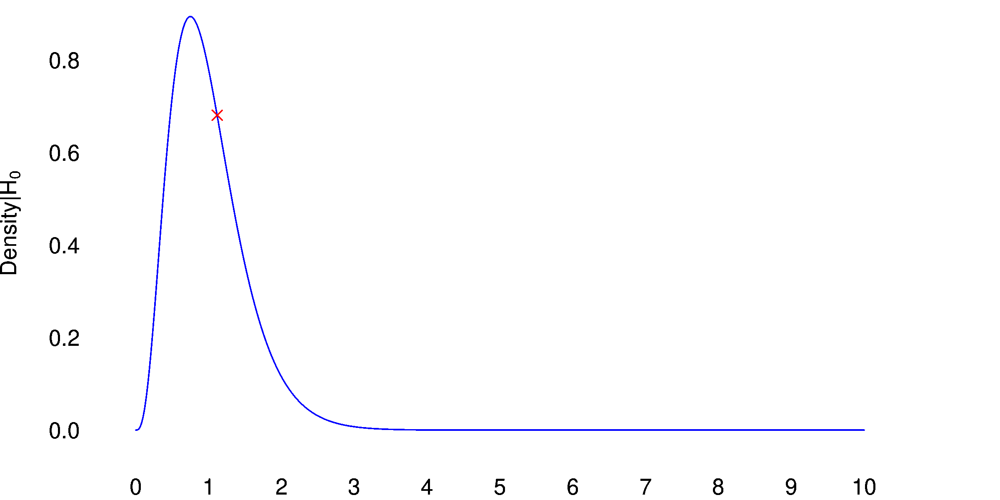
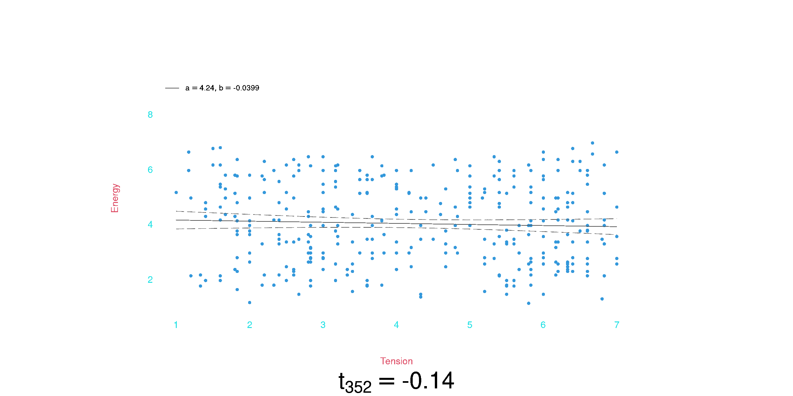
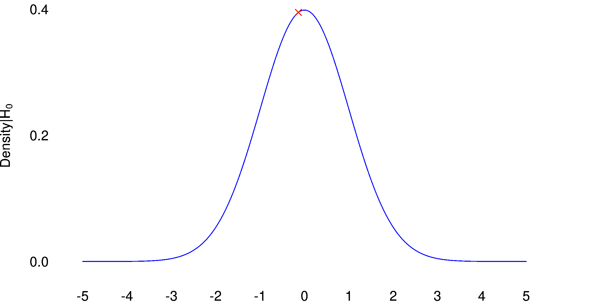

```{r}
library(stringr)
library(broom)
library(humdrumR)
par(bg = "#fdf6e3")
```

# Data Analysis

## What is the goal of data analysis?

+ To support *valid* research claims,
+ by...
  + being **rigorously skeptical** of our own data and analyses;
  + Considering alternative explanations of observed relationships;
  + Recognizing and stating our assumptions;
  + genuinely trying to **falsify** our hypotheses.

# Null Hypothesis Significance Tests

## Motivation

+ NHST is...
  + A crucial opportunity to falsify our hypotheses;
  + **the** standard approach to experimental statistics across many fields of research;
    + A validly-conducted "significant" test is (essentially) required to make a positive claim about your hypothesis.


## Core Idea

+ The *Null Hypothesis* ($H_0$), is that there are no **true** relationship between independent and dependent variable(s).
  + Even if $H_0$ is true, *apparent relationships may arise purely by random chance*. 
+ If we claim a relationship is real when it is not we make a Type 1 error.   
  + NHST is a mechanism for limiting Type 1 errors.


## Core Method {.smaller}

::: {.panel-tabset}

### A priori


1. Pick an "$\alpha$ level" (acceptable Type 1 error rate).
   + Just kidding; $\alpha := 0.05$
2. Describe a statistical model of the relationship(s) between experimental variables.
   + $\beta_0 + \beta_1X + \epsilon = Y$
3. Characterize the Null Hypothesis in the context of that model.
   + Usually, something like $H_0: \beta_1 = 0$.

### A posteriori

4. Gather data.
5. Compute probability of observed data, or “more extreme” data, *given* $H_0$.
   + This is a $p$ value.
6. Evaluate:
   + If $p \leq \alpha$, then result is considered "*significant*."
   + If $p > \alpha$ your result is "not significant."


:::

## Interpretation

+ If $p \leq \alpha$, 
  + you may claim that your hypothesis has been supported by the data.
 + If $p > \alpha$, 
  + you must acknowledge that the data is not consistent with your hypothesis.
    + Your research claim is (tentatively) falsified.
    + To argue otherwise will be an uphill battle.
    
---

### Rationale

Apply NHSTs assures that at most 5% of positive (significant) research claims are Type 1 errors.

+ It does not...
  + *Prove* anything, either way.
  + Demonstrate that a relationship (effect) is strong or important.
  + Tell us about Type 2 errors.


## Practical

What does this all look like in practice?

1. Determine which "statistical test" is appropriate for your data and $H_0$.
2. Find statistics library which includes this test.
   + `R` is simplest place to look.
3. Load data into R/Python/etc.
4. Run test on data.
5. Interpret output, and put into your paper.
   + Is the test significant? (yes/no)
   + Include appropriate details.
   
---

I'll now walk through some examples, using R.

+ We will start with basic ("baby step") examples, before finishing with a review of real *best practices*.


# Statistical Tests {.smaller}


To conduct an NHST, we need to compute $p$ values for our data, given our Null Hypothesis.

+ Basically, we need a function $f(\textbf{IV}_{n\times k},\ \textbf{DV}_{n \times j},\ H_0) = f(Data\ |\ H_0) = p$.
  + Where,
    + $IV_k$ is $k$ independent variables.
    + $DV_j$ is $j$ dependent variables ($j := 1$ for this talk).
    + $n$ is the number of data observations.
+ Every "statistical test" is such a function.

---


To compute $p$, all tests compute a **test statistic** with a known probability distribution.

+ For example: 
  + $ANOVA(\textbf{IV}_{i\times k},\ \textbf{DV}_{i}) = F$
  + $F \sim \mathcal{F}(\frac{k - 1}{n - k})$
    + We can compute $p(F)$, using the $\mathcal{F}(\frac{k = 1}{n - ik})$ distribution.
+ Test statistics can also be simulated using your data ("bootstrapping").


## Model vs Tests {.smaller}

::: {.panel-tabset}

### Parametric 

Most statistical tests are based on "parametric" models, modeling relationships between variables and making assumptions about the distribution of error in the data.

+ Variants of the *general linear model* are the most common, by far.
  + $\beta_0 + \beta_1X + \epsilon = Y$
  + $\epsilon \sim \mathcal{N}(0, \sigma)$
+ Test statistics may either represent particular model parameters ($t$) or the improvement of fit when comparing two models ($F$, $\chi^2$).

### Non-parametric

Other tests are "non-parametric," making fewer/no assumptions about the data.

+ They are less *powerful*, but more *robust* ("safer").
+ Examples include...
  + [Pearson's $\chi^2$ test](https://en.wikipedia.org/wiki/Pearson%27s_chi-squared_test).
  + The [Mann-Whitney U test](https://en.wikipedia.org/wiki/Mann%E2%80%93Whitney_U_test].


:::


---

## Choosing a Test

::: {.panel-tabset}

### General considerations 

Start with linear models. 

+ The choice of test depends on the nature of your independent and dependent variables.
+ Generally, the general linear model can accommodate any combinations, so we're always choosing variants of the same thing.


### Independent Variable(s)

Generally, any combination of independent variables can be used.

+ Categorical, numeric, etc.
  + The interpretation of model parameters changes, but the test is the same.
+ Interactions? 
+ Covariates.
  + Include any covariates that make sense, so the model can control for them.


### Dependent Variable

The main question is the nature of your dependent variable.

+ What kind of variable?
  + Continuous, real numbers?
  + Categories? Ordered categories?
  + Rank/Count data?
+ What does error look like?
  + Is normal distribution plausible model?
     

:::

---

In R, we write `lm(DV ~ IV)`.

Additional variables, can be added:

+ `lm(DV ~ IV1 + IV2)`
+ `lm(DV ~ IV1 + IV2 + IV1:IV2)`
+ The default assumption is that DV is a continuous variable, with normal error.
+ The IVs can be any types of variables.
  + If the IVs are categorical, we have a $t$-test (single binary IV) or ANOVA.
  + If the DVs are continuous, we have a linear regression, or multiple regression.
  + We can mix categorical/continuous as well.


# Examples


## Quality Evaluation Data

```{r, echo = 1}
SiSEC <- read.csv('../SiSEC08_source_separation/SiSEC08_parsed.csv') |> subset(grepl('Algo', Algorithm))

par(cex.axis = .6, pch = 16, cex = .5)

SiSEC <- as.data.table(SiSEC)
SiSEC[, Order := rank(Ratingscore + rnorm(length(Ratingscore), 0, 40)), by = Listener]
SiSEC <- SiSEC[order(SiSEC$Listener, SiSEC$Order), ]


```


**SiSEC** dataset.

+ Fourteen participants.
+ Nine test conditions (algorithms).
+ Fourteen base audio recordings (8 speech, 6 music).
+ $N = 14 * 9 * 14 = 1764$ total ratings.

---

How do approach this using NHST?

+ First things first: **what is the Null Hypothesis?**.
+ Presumed hypothesis is that some algorithms perform better than others.
+ Therefore, $H_0$: *All nine algorithms actually perform equally well*.
  + This called the "omnibus null hypothesis."

----

::: {.panel-tabset}

### Dependent Variable

Ratings range from 0 to 100.

```{r}
par(bg = "#FFFFFF00")
draw(SiSEC$Ratingscore, col = 2, xlab = 'Quality rating')

```

+ Continuous numeric DV, with plausibly normal distribution.


### Independent Variable(s)

Main IV is categorical with nine levels (nine algorithms).

+ Possible covariate is the type of stimuli: music vs speech (binary variable).
+ There could plausibly be interactions between algorithm and target/type.
  + The Null Hypothesis would have these interactions as 0.


:::


+ This variant of the linear model is called ANOVA. 
  + $9\times 4 \times 2$ ANOVA (though not fully factorial).
  + The ANOVA is based on a $F$ test, comparing the fit of the model with/without each variable.
  + $H_0$ is that the mean-value for the DV is the same in all nine IV levels.


---

#### ANOVA


If $H_0$ true, ratio of between-group and with-group variance should follow the $F(\frac{df_1}{df_2})$ distribution.
    
    
```{r, out.width=800}
# library(gifski)
# 
# save_gif(gif_file = 'images/ANOVAs.gif', delay = .5, res = 320, height = 1200, width = 2400, progress = TRUE, {
#   for (i in 1:100) {
#     set.seed(i)
#     ratings <- SiSEC$Ratingscore |> sample()
#     fit <- lm(ratings ~  Algorithm * Type, data = SiSEC)
#     draw(SiSEC$Algorithm, ratings, xlab = '', ylab = 'Rating', pch = 16, bg = '#ffffff00', quantiles = c())
#     mtext(bquote(F[1755]^8 == .(round(summary(fit)$fstatistic[1], 2))), 1, cex = 1.32, line = 4, xpd =T)
#   }
# 
# })

knitr::include_graphics('images/ANOVAs.gif')
```

```{r, out.width = 800}
# save_gif(gif_file = 'images/ANOVAs_F.gif', delay = .5, res = 320, height = 1200, width = 2400, progress = TRUE, {
#   allfs <- c()
#   for (i in 1:100) {
#     set.seed(i)
#     ratings <- SiSEC$Ratingscore |> sample()
#     fit <- lm(ratings ~ Algorithm * Type, data = SiSEC)
# 
#     Fs <- summary(fit)$fstatistic[1]
#     par(bg = '#ffffff00', mar = c(2,4,0,4))
#     curve(df(x, 8, 1755), 0, 10, n = 1000, col = 'blue', xlim = c(0, 10),
#           xlab = quote(F[1755]^8), ylab = quote(paste(Density, '|', H[0])),
#           axes = FALSE)
#     points(Fs, df(Fs, 8, 1755), col = 'red', pch = 4)
#     if (i > 1) points(allfs, df(allfs, 8, 1755), col = 'grey50', cex=.5, pch = 4)
#     allfs <- c(allfs, Fs)
#      axis(1, seq(0, 10, 1), tick = FALSE)
#     axis(2, seq(0, 1, .2), tick = FALSE, las = 1)
#   }
# 
# })

 

```

---    


```{r}
SiSEC |> with(draw(Algorithm, Ratingscore, bg = '#ffffff00'))
```


----

    
    

```{r eval = FALSE, echo = TRUE, comment=""}
lm(Ratingscore ~ Algorithm * Type, data = SiSEC) |> anova()
```

```{r}
fit <- lm(Ratingscore ~ Algorithm*Type, data = SiSEC)

anova(fit) -> tab 

tab[1:3, 'Pr(>F)'] <- c(format(tab[1, 'Pr(>F)'], scientific = TRUE)  |> str_replace('\\.([0-9][0-9])[0-9]*', '.\\1'),
                     format(tab[2:3, 'Pr(>F)'], scientific = TRUE, digits = 2))
tab[,'F value'] <- round(tab[, 'F value'], 2)
tab[is.na(tab)] <- ''

tab |> knitr::kable(digits = 2, format.args = list(big.mark = ','))
Fs <- anova(fit)['Algorithm','F value']

par(bg = '#ffffff00')
curve(df(x, 8, 1746), 0, Fs, n = 1000, col = 'blue', xlim = c(0, 100),
      xlab = quote(F[1755]^8), ylab = quote(paste(Density, '|', H[0])),
      axes = FALSE)
curve(df(x, 8, 1746), Fs, 100, n = 1000, col = 'red', xlim = c(0, 100), add =TRUE)
axis(1, seq(0, 100, 10), tick = FALSE)
axis(2, seq(0, 1, .2), tick = FALSE, las = 1)

points(Fs[1], df(Fs[1], 8, 1755), col = 'red')


```


+ As we suspected, the omnibus Null Hypothesis does not seem very plausible.

## Emotion Data


```{r, echo = 1}
emote <- fread('../Eerola_emotion/mean_ratings_set1.csv')
```

Eerola's **Music and emotion stimulus sets consisting of film soundtracks**.


+ Stimuli with twelve target emotions
  + `r unique(emote$TARGET |> str_to_title()) |> paste(collapse = ', ')`
+ Eight rated emotional dimensions
  + `r paste(str_to_title(colnames(emote)[2:9]), collapse = ', ')`
  + Scale of 1--9

---


*Hypothesis*: Perceived energy is related to tension.

How do approach this using NHST?

+ $H_0$: There is no relationship between energy and tension ratings.

    
----


::: {.panel-tabset}

### Dependent Variable

Energy ratings from 0 to 9.

```{r}
par(bg = "#FFFFFF00")
draw(, emote$energy, col = 2, ylab = 'Energy rating', ylim = c(1, 9))

```

+ Sort-of continuous numeric DV, with (sort of) plausibly normal distribution?


### Independent Variable(s)

Main IV is tension, but all eight emotion ratings are correlated:

```{r, echo = TRUE, eval = FALSE}
cor(emote[ , 2:9])
```

```{r}
cor(emote[, 2:9]) |> format(digits = 2) -> cortab 
colnames(cortab) <- rownames(cortab) <- str_to_title(colnames(cortab))
cortab[upper.tri(cortab)] <- ''

cortab |> knitr::kable()

```

+ These correlations could lead to spurious results.
  + We can control for them by including all seven independent predictors;
  + This isolates the effect of tension, independent of other ratings.
+ There could plausibly be interactions as well...


:::


+ This variant of the linear model is called Multiple Regression. 
  + If we don't include interactions, we can test the effect using the $t$ statistic associated with the tension variable.
    + $H_0$ is that the "slope" between tension and energy is zero ($b_{tension} = 0$).
  + However, in more complex cases, it would be easier to again use an $F$ test, comparing the fit of the model with/without each variable.


    
----

#### Linear Regression

If $H_0$ is true, standardized regression coefficient should follow Student's $t(df)$ distribution.


```{r, out.width=1000}
# library(gifski)
# 
# save_gif(gif_file = 'images/ts.gif', delay = .5, res = 320, height = 1200, width = 2400, progress = TRUE, {
#   for (i in 1:100) {
#     set.seed(i)
#     energy_rand <- emote$energy |> sample()
#     fit <- lm(energy_rand ~ . , data =emote[,c(2,4,5,6,7,8,9)])
#     draw(emote$tension, energy_rand, xlab = 'Tension', ylab = 'Energy', alpha = 1, col = 2, bg = '#ffffff00', ylim = c(1,9), lm = TRUE)
# 
#     Ts <- coef(summary(fit))['tension', 't value']
#     mtext(bquote(t[352] == .(round(Ts, 2))), 1, cex = 1.32, line = 6, xpd =T)
#   }
# 
# })


```

```{r, out.width = 800}
# library(gifski)
# save_gif(gif_file = 'images/ts_t.gif', delay = .5, res = 320, height = 1200, width = 2400, progress = TRUE, {
#   allts <- c()
#   for (i in 1:100) {
#     set.seed(i)
#     energy_rand <- emote$energy |> sample()
#     fit <- lm(energy_rand ~ . , data =emote[,c(2,4,5,6,7,8,9)])
# 
#     Ts <- coef(summary(fit))['tension', 't value']
#     par(bg = '#ffffff00', mar = c(2,4,0,4))
#     curve(dt(x, 352), -5, 5, n = 1000, col = 'blue', xlim = c(-5, 5),
#           xlab = quote(t[352]), ylab = quote(paste(Density, '|', H[0])),
#           axes = FALSE)
#     points(Ts, dt(Ts, 352), col = 'red', pch = 4)
#     if (i > 1) points(allts, dt(allts, 352), col = 'grey50', cex=.5, pch = 4)
#     allts <- c(allts, Ts)
#      axis(1, seq(-5, 5, 1), tick = FALSE)
#     axis(2, seq(0, 1, .2), tick = FALSE, las = 1)
#   }
# 
# })

 

```


---

```{r}

with(emote, draw(tension, energy, xlab = 'Tension', ylab = 'Energy', alpha = 1,
                 col = 2, bg = '#ffffff00', lm = T))

fit <- lm(energy ~ ., data = emote[ , 2:9])
xs <- seq(1, 9, .1)
pred <- predict(fit, newdata = do.call('data.frame', c(list(tension = xs), colMeans(emote[, c(2,4:9)]))), interval = 'confidence')

points(xs, pred[, 'fit'], type = 'l', lwd = 2, col = 2)
points(xs, pred[, 'lwr'], type = 'l', lwd = 1, col = 2, lty = 'dashed')
points(xs, pred[, 'upr'], type = 'l', lwd = 1, col = 2, lty = 'dashed')

```
  
----


```{r, echo = TRUE, results='hide'}
lm(energy ~ tension + valence + anger + fear + happy + sad + tender , data = emote[ , 2:9]) |> summary()
```

```{r, out.width = 800}
fit <- lm(energy ~ . , data = emote[ , 2:9])

summary(fit) |> tidy(conf.int = TRUE) -> tab

tab$estimate <- round(tab$estimate, 2)
tab$std.error <- round(tab$std.error, 2)
tab$statistic <- round(tab$statistic, 2)
tab$conf.low <- round(tab$conf.low, 2)
tab$conf.high <- round(tab$conf.high, 2)
tab  |> knitr::kable()


Ts <- coef(summary(fit))['tension', 't value']

par(bg = '#ffffff00')
curve(dt(x, 352), -5, Ts, n = 1000, col = 'blue', xlim = c(-5, 15),
      xlab = quote(t[352]), ylab = quote(paste(Density, '|', H[0])),
      axes = FALSE)
curve(dt(x, 352), Ts, 100, n = 1000, col = 'red', xlim = c(0, 100), add =TRUE)
axis(1, seq(-4, 14, 2), tick = FALSE)
axis(2, seq(0, 1, .2), tick = FALSE, las = 1)

points(Ts, dt(Ts, 352), col = 'red')
```


<!-- #### Logistic Regression -->

<!-- ```{r} -->
<!-- negative <- c('ANGER', 'FEAR', 'LOW VALENCE', "SAD", 'HIGH TENSION') -->

<!-- emote$Negative <- emote$TARGET == negative -->

<!-- glm(Negative ~ valence + energy + tension + anger + fear + happy + sad + tender, data = emote) |> anova() -->

<!-- ``` -->


# NHST pitfalls


Let's explore some potential, known challenges with NHST.

----

```{r}
SiSEC |> with(draw(Algorithm, Ratingscore, bg = '#ffffff00'))
```

What if we want to know if the best algorithm is significantly better than the other aglorithms as a whole?

----


```{r}

SiSEC$BestAlgo <- SiSEC$Algorithm == 'Algo22'

fit <- lm(Ratingscore ~ BestAlgo * Type, data = SiSEC)

lm(fit) |> summary()

```

+ This is significant.
+ However, there is a problem...
  + We did not identify this "best algorithm" *a priori*.
  + And the NHST is sensitive to this.
  
---

Imagine that the Null Hypothesis *were* true: all algorithms performed equally well.

+ Every time we sample responses, one algorithm will perform best in the sample.
  + By picking this one out, we are (by definition) biasing the result.
  
---

We can simulate this:

```{r, cache = TRUE}
Nsim <- 1000

# pvalues <- sapply(1:Nsim, \(i) {
#   SiSEC$RandomRating <- sample(SiSEC$Ratingscore)
#   
#   sortedMeans <- with(SiSEC, tapply(RandomRating, Algorithm, mean)) |> sort(decreasing = TRUE)
#   SiSEC$RandomBest <- SiSEC$Algorithm == names(sortedMeans)[1]
#   
#   fit <- lm(RandomRating ~ RandomBest, data = SiSEC)
#   
#   pvalue <- summary(fit)$coef[2, 4]
#   pvalue
# })
# save(pvalues, file = 'simulation_bestrest.Rd')
load('simulation_bestrest.Rd')

plot(seq(0, 1, length.out = Nsim), sort(pvalues), xlab = 'Quantile', pch = 16, cex = .5,
     col = ifelse(sort(pvalues) <= .05, 'red', 'black'), axes =FALSE, ylab = quote(p))
axis(1,seq(0,1,.1), tick = FALSE)
axis(2, seq(0,1,.1), las = 1, tick = FALSE)

abline(h = .05, col = 'red', lty='dashed')

Type1errorRate <- mean(pvalues <= .05)
text(Type1errorRate, .1, bquote("" %<-% .(paste0(Type1errorRate * 100, '%'))), col = 'red')


```


---

In general, NHST is sensitive to the exact procedure you use.

+ Any procedural decisions are made *post-hoc*, they can affect the validity of results.
+ I.e., *if you use the data to to make decisions about stats/tests*, the $p$-value won't be accurate.

----

Common pitfalls:


+ Post-hoc **stopping condition**
  + If you decide when to stop collecting data based on the data.
+ Post-hoc **comparisons**
  + When you decide which comparisons to make/test.


## Multiple comparisons.


A particularly well known problem is the problem of *multiple tests*.

+ Anytime you conduct multiple NHSTs, the chance that *at least one* test will be significant is higher than $\alpha$.

----

A common technique is to conduct "pair-wise" $t$-tests between every category, so we would know exactly which algorithms perform better than others.

```{r, echo = FALSE}
plot(Ratingscore ~ factor(Algorithm), data = SiSEC)

```

+ In this case there would be 36 possible comparisons.


---

If we simulate this

```{r cache=TRUE}
library(combinat)
Nsim <- 1000
pairs <- combn(unique(SiSEC$Algorithm), 2, simplify = FALSE)

# Nsignificant <- sapply(1:Nsim, \(i) {
#   SiSEC$RandomRating <- sample(SiSEC$Ratingscore)
# 
#   pairedPvalues <- sapply(pairs,
#                           \(pair) {
#                             fit <- lm(RandomRating ~ Algorithm, data = SiSEC |> subset(Algorithm %in% pair))
#                             pvalue <- summary(fit)$coef[2, 4]
#                             pvalue
#                           })
#   sum(pairedPvalues <= .05)
# 
# })
# save(Nsignificant, file = 'simulation_multipleTests.Rd', compress = TRUE)
load('simulation_multipleTests.Rd')
table(Nsignificant) |> prop.table() |> sort(decreasing = TRUE) |> cumsum() -> props
 
plot(1-props, col = ifelse(names(props) == '0', 'black', 'red'), main = 'Proportion of Simulations with\nat Least N Significant Tests', type = 'b',
     ylab = 'Proporiton of Simulations',
     axes = FALSE,
     x = as.integer(names(props)),
     xlab = 'N Significant Tests', ylim = c(0, 1), pch = 16)
axis(1, 0:20, tick = FALSE)
axis(2, seq(0,1,.1), paste0(seq(0,100,10), '%'), las = 1, tick = FALSE)
```

+ More than forty percent of our (Null Hypothesis) simulations have *at least one* significant tests.
  + This is the "family-wise error rate" 
+ This, if we conducted 36 significance tests and consider *one* significant result to be the basis to reject the Null Hypothesis, we would make a Type 1 error more than 40% of the time!

### Correcting for Multiple Comparisons

We can "correct" for multiple tests by adjusting our $p$-values (or $\alpha$ level) accordingly.

+ The naive *Bonferroni correction* is simply to use $\frac{\alpha}{T}$, where $T$ is the number of tests. 
  + This highly conservative (overly cautious), because our tests are not statistically independent from each other.
  + There are many other approachess, such as Tukey's Method.

---

The main lesson is that, whenever you conduct multiple NHST tests, you need to take them with an extra skeptical grain of salt.

+ If you conduct many tests (like hundreds or thousands), some of those will have $p < .05$. 

## Assumptions

We might hypothesis that happiness and sadness ratings should be negatively correlated.

+ This could be a simple linear regression.
+ However...

---

The distribution of the errors is not plausible normal.

+ Too many 1s.

```{r}
with(emote, draw(happy, sad, xlab = 'Happy rating', ylab = "Sad rating", lm = TRUE))

```

----

You could rethink how to express the hypothesis in a way that is more consistent with the data.

+ Logistic regression, use happiness to predict whether sad rating is or isn't 1.

```{r}
emote$NotSad <- emote$sad > 1

logfit <- glm(NotSad ~ happy, data = emote)

with(emote, draw(happy, sad, xlab = 'Happy rating', ylab = "Sad rating", lm = TRUE))

xs <- seq(1,9,.01)
points(xs, plogis(exp(.72753 + xs * -.05287))*9)


summary(logfit) 


```


# Data Independence

All statistical models assume that each individual data point is *statistically independent* of every other data point.

+ This assumption is often violated in experimental research.

## Repeated measures

The most common source of data dependence is *repeated measures*:

+ Repeated measurements from the same human participants.
+ Repeated responses to the same stimuli ("items").

---

Take a look at your quality ratings again:

::: {.tabset-panel}

### By participant

```{r, echo = FALSE}
par(las=2, cex.axis=.6)
with(SiSEC, draw(bg = '#ffffff00', factor(Listener), Ratingscore), pch = 16,
     xlab = 'Participant', ylab = "Rating")


```

+ Participant 62 tends to give much higher ratings than participant 45.

### By item

```{r, echo = -1:-2}

par(las=2, cex.axis=.6)
with(SiSEC, draw(bg = '#ffffff00', factor(Target), Ratingscore), pch = 16,
     xlab = 'Target', ylab = "Rating")


```
+ Again, the specific measurement items vary quite a lot in average rating, *across all algorithms*.

:::
  
  
---

In a well-designed experiment like this, every combination of all levels is measured.

+ I.e., every participant heard every item processed by every algorithm.
+ This "full factorial" design minimized the impact of data dependence on our results.
  + However, fully-factorial designs are not always feasible.
  
---

Even in a fully-factorial design, data dependence can be problematic.

+ If I inspect five data points from a given participant, I can use that data to guess what their other data points will be.
  + Thus, each individual data point communicates less information.
  + Thus, the amount of information in the data is actually less than the apparent sample size.
    + This can make statistical models underestimate the true uncertainty of estimated statistics.
    
## Random-Effects Models

A generalized solution the problem of data dependence is through random effects models.

+ In these models, multiple sources of random error are explicitely modeled:
  + A random sample of participants.
  + A random sample of measurement items.
  + Within participants/items, random residual error.
+ We can represent:
  + variation in baselines between participants/items using *random intercepts*.
  + variation in the effects of independent variables using *random slopes*.
  
  
+ We can use the `lme4` package to fit random-effects models for various versions of the GLM.


---

We can thus conduct a best-practice version of our omnibus ANOVA test.

```{r, eval = FALSE, cache = TRUE}
library(lme4)
library(lmerTest)
# mlvfitnull <- lmer(Ratingscore ~ 1 + (Algorithm|Listener) + (Algorithm|Trial), data = SiSEC, REML = FALSE)
# mlvfit <- lmer(Ratingscore ~ Algorithm + (Algorithm|Listener) + (Algorithm|Trial), data = SiSEC, REML = FALSE)
load('fit_quality_mlv.Rd')
load('fit_quality_mlvnull.Rd')

anova(mlvfitnull, mlvfit, test = 'F')

```

+ The difference between algorithm ratings is still statistically significant.
  + The $F$ statistic for this new model ($F \approx 10$) is much smaller than for the naive ANOVA we conducted earlier ($F \approx 80$), because this model more accurately reflects the true uncertainty in the data.
+ We've been good skeptics!

## Non-random dependence


Another possibility is for data-dependence to be non-random.

For example, we might look at how participants' ratings evolved over the course of their experimental session and see something like:

```{r}

with(SiSEC, draw(Order, Ratingscore, lm = TRUE, col = 2, bg = '#FFFFFF00'))

```

+ Participants' ratings tended to get higher over time!^[The SiSEC data didn't include order information, so I faked this data.]
  + The data is autocorrelated, with $r =$ `r with(SiSEC, cor(head(Ratingscore, -1), tail(Ratingscore, -1))) |> round(2)` at lag 1.
+ As before, it means each data point contains less unique information, because they can be predicted from past ratings.

----

We an explicitly incorporate this autocorrelation into our model:


```{r}

SiSEC <- within(SiSEC, PreviousRating <- unlist(tapply(Ratingscore, Listener, \(rs) c(NA, head(rs, -1)) )))

anova(lm(Ratingscore ~ Algorithm * Type +  PreviousRating, data = SiSEC)) |> tidy() |> knitr::kable()

```

# Effect Size

---

A statistically significant effect tells us nothing about how strong an effect is.

+ With enough data (or little variability) even small effects can be significant.

---

Effect size should be reported independently of statistical tests.

+ Use graphs to visualize effect size in meaningful way.
+ Report standardized metrics:
  + $r$, $R^2$, $\beta$, coefficient of variation, Coen's $d$
+ Report non-standardized metrics:
  + $b$

---

Do not use $p$ values as effect-size metrics.

+ $p < .01$, $p < .001$, $p < .0000001$, etc.
+ This is a common practice, but $p$ values are **bad** inferential statistics, and bad measures of effect size.


# Summary

+ NHST is important first step in evaluating experimental results
+ Find model appropriate for your variables
+ Look out for dependent data
  + Incorporate random effects to account fo repeated measures.
  + Explicitly model other sources of dependence.
+ Post-hoc
  + Do not make decisions based on data.
    + Stopping condition
    + Post-hoc comparisons
  + Correct for multiple tests